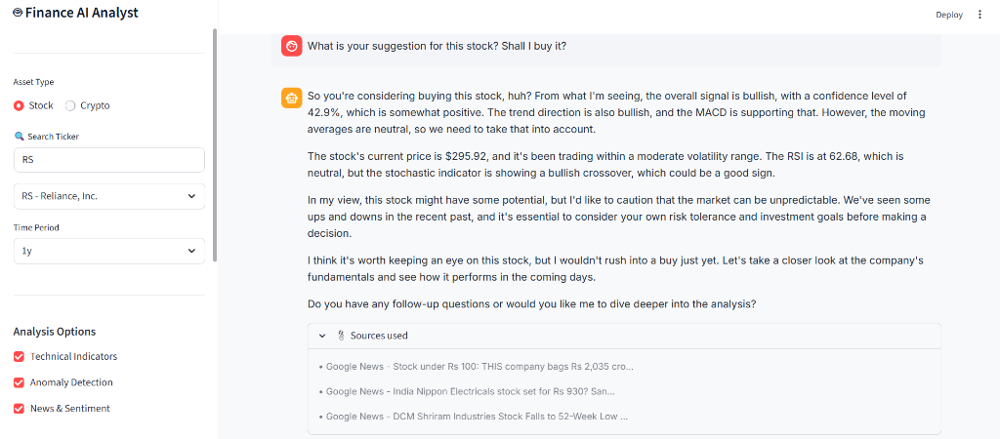
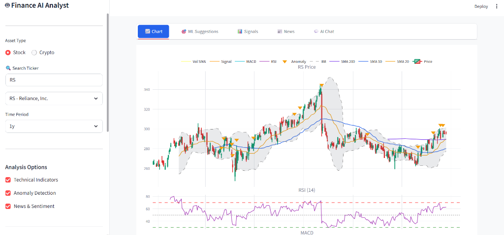
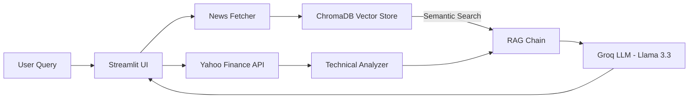

# 🤖 Finance Analytics Agent 

An **AI-powered financial analytics agent** with RAG-enhanced chat, ML-backed suggestions, pattern recognition, and uncertainty-aware predictions. Pulls live data, runs quantitative models, and explains insights in natural language with interactive charts.

<p align="center">
  
  
  
  
  
</p>

---

## 🎬 Live Demo

<p align="center">
  <a href="https://drive.google.com/file/d/1z1jH-9KxhVnylffi2PhpvZUGbk5cof-Q/view?usp=sharing">
    
  </a>
</p>

> 🎥 **Click above to watch the full demo video!** See the AI chat with RAG in action, real-time ticker search, and ML-powered trading suggestions.

---

## 📸 Screenshots

### 🧠 AI Chat with RAG (Retrieval-Augmented Generation)
*Ask natural language questions and get intelligent, context-aware answers powered by real-time news and technical data*



### 📈 Professional Technical Analysis Charts
*30+ indicators including Bollinger Bands, RSI, MACD with anomaly detection and signal overlays*



---

## ✨ What Makes This Special

| Feature | Description |
|---------|-------------|
| 🧠 **RAG-Powered AI Chat** | Not just GPT wrapper - uses ChromaDB vector store with real-time news ingestion. AI cites actual sources! |
| 🔍 **Ticker Autocomplete** | Real-time Yahoo Finance search API - type company names or symbols |
| 📊 **30+ Technical Indicators** | RSI, MACD, Bollinger Bands, ADX, Stochastic, ATR and more with signal generation |
| 🎯 **ML Suggestions** | Pattern matching with historical periods, Monte Carlo simulations, confidence scoring |
| 📰 **Live News Integration** | Aggregated from Google News, Seeking Alpha, Finnhub - auto-ingested to knowledge base |
| 🌡️ **Fear & Greed Index** | Real-time market sentiment indicator |
| 📉 **Anomaly Detection** | Z-score, IQR, and Isolation Forest methods identify unusual price movements |

---

## 🏗️ Architecture



---

## 🛠️ Technology Stack

| Category | Technologies |
|----------|--------------|
| **Core** | Python 3.11+, Pydantic |
| **Data** | yfinance, CoinGecko, NewsAPI, Google News RSS |
| **ML/Quant** | scikit-learn, scipy, statsmodels, arch (GARCH) |
| **RAG & AI** | LangChain, Groq (Llama 3.3 70B), ChromaDB, sentence-transformers |
| **Visualization** | Plotly, Streamlit |
| **Technical Analysis** | ta (Technical Analysis library) |

---

## 🚀 Quick Start

### 1. Clone and Setup

```bash
git clone https://github.com/YOUR_USERNAME/finance-analytics-agent.git
cd finance-analytics-agent
python -m venv venv

# Windows
.\venv\Scripts\activate
# Linux/Mac
source venv/bin/activate

pip install -r requirements.txt
```

### 2. Configure Environment

```bash
cp .env.example .env
```

Edit `.env` and add your API key:

```env
# Required for AI Chat (free at https://console.groq.com)
GROQ_API_KEY=your_groq_key
```

### 3. Run the Dashboard

```bash
streamlit run ui/app.py
```

Open `http://localhost:8501` in your browser.

---

## 💡 Key Features Deep Dive

### 🧠 RAG-Powered AI Chat

Unlike typical chatbots, this agent uses **Retrieval-Augmented Generation**:

1. **News Ingestion** - When you analyze a stock, news articles are automatically embedded into ChromaDB
2. **Semantic Search** - When you ask a question, relevant context is retrieved from the vector store
3. **Augmented Response** - LLM generates response with actual data + sources
4. **Transparency** - "Sources used" expander shows exactly which articles informed the answer

### 🎯 ML Suggestions Engine

Combines multiple factors with weighted scoring:

| Factor | Weight | Description |
|--------|--------|-------------|
| Technical Signals | 30% | Overall signal from 30+ indicators |
| Historical Patterns | 25% | Similar periods and their outcomes |
| Timeframe Confluence | 25% | Daily/Weekly/Monthly alignment |
| Monte Carlo | 20% | Risk-adjusted probabilistic outlook |

### 📈 Price Prediction with Uncertainty

- Ensemble predictions (GARCH + Monte Carlo)
- 50%, 80%, 95% confidence bands
- Never false precision - always ranges

---

## 📁 Project Structure

```
finance-analytics-agent/
├── src/
│   ├── data/fetchers/          # Data ingestion (Yahoo, News)
│   ├── models/
│   │   ├── technical_indicators.py
│   │   ├── anomaly_detection.py
│   │   ├── suggestions_engine.py
│   │   └── price_predictor.py
│   ├── rag/
│   │   ├── vector_store.py     # ChromaDB + embeddings
│   │   └── chain.py            # LangChain RAG pipeline
│   └── visualization/
├── ui/app.py                    # Streamlit dashboard
├── assets/                      # Screenshots
└── requirements.txt
```

---

## 🔒 Disclaimer

This tool is for **educational and research purposes only**. It does not provide financial advice. Always do your own research and consult with a qualified financial advisor before making investment decisions.

---

## 📄 License

MIT License - See LICENSE file for details.

---

<p align="center">
  Built with ❤️ on a weekend using Python, LangChain, Streamlit, and Groq
</p>
